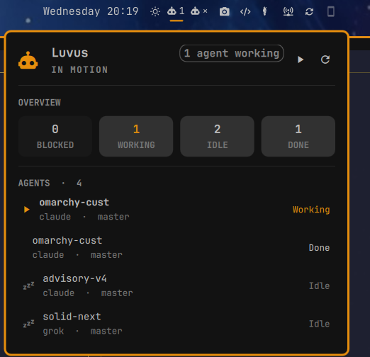

# omarchy-luvus

An Omarchy shell plugin for [luvus](https://github.com/RizRiyz/luvus): the
coding agents you have running, in the bar, with a click to go to whichever one
is waiting for you.

One glyph and one number. The number answers the only question a bar can usefully
answer at a glance — *is anything waiting for me?* — so blocked agents outrank
working ones, which outrank a plain count, and the urgent colour is spent on
nothing else.

```
󰚩 2      two agents blocked, in the urgent colour
󰚩 5      nothing blocked, five working
󰚩 9      nothing running, nine agents exist
󰚩 ×      luvus is not running
```

Click for the panel. Middle click to refresh. Right click to jump straight to
whatever needs you.

<p align="center">
  
</p>

## Requires

- [luvus](https://github.com/RizRiyz/luvus) 0.11 or newer — get it from
  [luvus.dev](https://luvus.dev), which has the install line for Linux, macOS
  and Windows. Running `luvus` in any terminal starts the server this reads.
  Tested against 0.12.0 and 0.13.1.
- The Omarchy shell.
- A Nerd Font for the glyphs — Omarchy's default bar font already is one.

No jq, no helper script, no daemon of its own. `luvus agent list` prints JSON
without being asked, so the plugin parses it directly. The only other programs
it runs are the coreutils that bound what luvus is allowed to hand back —
`timeout`, `head`, `fold`, `stdbuf` — which are already on any machine running
Omarchy.

## Install

```bash
omarchy plugin add https://github.com/riclib/omarchy-luvus.git --enable
omarchy restart shell
```

`--enable` places the widget for you — it asks which bar section, offering the
centre by default — and writes `~/.config/omarchy/shell.json` itself. There is
no file to edit by hand.

To place it later, or to move it:

```bash
omarchy plugin enable riclib.luvus --section right
```

> Omarchy plugins are unsandboxed code running inside the long-lived shell
> process. Read the source before installing this or any other one.

## Update

```bash
omarchy plugin update riclib.luvus --yes
omarchy restart shell
```

Without `--yes` it prints the incoming diff and waits for a keypress.

## Remove

```bash
omarchy plugin remove riclib.luvus
omarchy restart shell
```

That is the whole removal, because the plugin's own folder is its whole
footprint. It creates no files, writes no configuration of yours, installs no
service, takes no keybinding, and stores nothing on disk — it reads luvus and
draws. Removing it takes the widget out of your bar layout and deletes the
checkout; luvus itself, its sessions and its data are untouched.

## Settings

All of these are also editable in the shell's widget settings UI.

| Key | Type | Default | Meaning |
|---|---|---|---|
| `session` | string | *(empty)* | Which luvus server session to watch. Empty means the default one. `luvus session list` names the others. |
| `luvusBin` | string | `luvus` | Resolved on PATH as a bare name. Set an absolute path if the widget says the binary is missing while your terminal finds it — the shell does not always inherit a login PATH. |
| `pushUpdates` | boolean | `true` | Hold a `luvus events` subscription open and refresh the moment something changes. Off falls back to polling alone. |
| `hideWhenIdle` | boolean | `false` | Show the widget only while an agent is working or blocked. It stays visible while the panel is open, and while luvus is unreachable — that is worth seeing. |
| `focusWindowClass` | string | *(empty)* | The Hyprland class of the terminal that hosts luvus. See [Jumping to an agent](#jumping-to-an-agent). |

## The panel

Four counts — blocked, working, idle, done — and then every agent luvus knows
about, worst first. Each row carries the agent kind, the branch, and a `⑂` when
it is off in a worktree, because a `working` claude on a worktree branch is a
different thing from one on master.

Keys, while the panel has focus: `r` refreshes, `g` jumps to whatever needs you,
`Escape` closes.

## When an agent reads as idle while it is plainly working

This widget shows what luvus reports. It detects nothing itself, so an agent in
the wrong state is nearly always luvus lacking a rule for it rather than the
widget being wrong — and it is worth knowing the difference before filing a bug
here.

luvus decides an agent's state by matching substrings against what the pane is
currently showing. Claude is covered out of the box; several of the fifteen
agents luvus recognises are not. Ask it what it saw:

```bash
luvus agent explain <pane-id>
```

`"source": "no_positive_state_evidence"` with `"confidence": "none"` means no
rule matched and `idle` is a fallback, not a finding.

Teach it, without rebuilding anything — one file per agent in
`~/.luvus/manifests/`, merged over the built-ins by priority:

```toml
# ~/.luvus/manifests/grok.toml
agent = "grok"

[[rule]]
state = "working"
priority = 200
region = "screen"
any = ["subagent still running", "send a message to interrupt"]
```

Then reload and re-check:

```bash
echo '{"id":"1","method":"server.reload_agent_manifests","params":{}}' | luvus uhp proxy
luvus agent explain <pane-id>
```

Pick the string the way that example does: something the agent prints *only*
while it is busy. An offer to interrupt is ideal — it exists only when there is
something to interrupt.

**Use `working` for busy, and keep `blocked` for genuinely needing a human.**
luvus reserves `blocked` for that — its built-in Claude rule is `"do you want to
proceed"` — and this widget spends the urgent colour and the right-click jump on
it. An agent waiting on its own subagent needs nobody, so marking it `blocked`
would send you somewhere nothing is wrong and devalue the one signal worth
interrupting you for.

## How it stays current

Two ways in, deliberately:

- **`luvus agent list`** — the whole truth, on demand.
- **`luvus events`** — a held-open NDJSON subscription that says *when* to ask
  again.

Events are a doorbell here, not a data source. `pane.agent_status_changed`
carries a full payload and it is tempting to apply it directly, but `pane.closed`
is emitted more than once for the same pane — so an incrementally-maintained list
would drift, with nothing to catch it doing so. A relevant event debounces for
300ms and then re-reads.

Both ways in are bounded before the answer reaches the shell rather than after
it arrives: the read through `timeout` and `head -c`, the subscription through
`fold`, which caps how long a single event line can grow. The bar is one widget
inside a shell that draws the whole desktop, and a line that never ends is
otherwise buffered in that shell's memory while it waits for a newline that may
never come.

A 30-second timer sits behind all of it. It is not the update mechanism; it is
the thing that notices the doorbell has stopped working — a luvus server
restarted, a subscription dropped, `pushUpdates` turned off. When the
subscription is down the panel says so, because "nothing is blocked" and
"nothing was blocked half a minute ago" are different claims.

If the subscription dies, it comes back with backoff (1s, 2s, 5s, 15s), and
thirty seconds of health resets that — so a server restarted twice in a week
never creeps toward the long backoff and stays there.

## Jumping to an agent

Right-clicking the bar glyph, pressing `g`, or clicking a panel row runs
`luvus pane focus <id>`, which moves the cursor to that pane inside the luvus
TUI.

It cannot raise the terminal window that hosts the TUI — nothing running inside
a terminal can. So the window half is opt-in: set `focusWindowClass` to the
Hyprland class of your terminal and the plugin will also dispatch
`hyprctl dispatch focuswindow class:<that>`. Find it with:

```bash
hyprctl clients | grep -A2 -i luvus
```

Left empty, the pane is focused and the window is left alone.

## Credit

This plugin began as a reading of
[**omarchy-herdr**](https://github.com/fabean/omarchy-herdr) by Josh Fabean,
which does the same job for [herdr](https://github.com/fabean/herdr). Its panel
worked out what an agent widget in this bar should show — counts across the top,
worst-first rows below, the urgent colour reserved for blocked — and that shape
is kept here almost intact, along with its status glyphs and its colour mapping.
The bar's robot glyph is the shared mark every agent widget in Omarchy wears, so
it carries over too.

What changed is underneath. herdr's plugin shells out through a `jq` script on a
blind three-second timer; luvus prints JSON without being asked and will tell you
when something changed, so this parses directly and waits on a subscription
instead. Rows are clickable here because `luvus pane focus` exists.

If you run herdr rather than luvus, use Josh's plugin — this is not a
replacement for it.

## Licence

MIT — see [LICENSE](LICENSE).

This plugin contains and links no luvus code — it executes the `luvus` binary
as a separate process and reads its stdout — so the MIT licence above applies to
this repository alone. luvus itself remains AGPL-3.0 for anyone who redistributes
it. Do not vendor luvus source into this repository.

Portions of `Panel.qml` and `AgentRow.qml` are derived from
[omarchy-herdr](https://github.com/fabean/omarchy-herdr) (MIT, Copyright (c)
2026 Josh Fabean); the notice is in [LICENSE](LICENSE).
